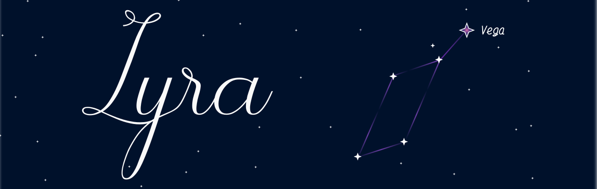

<p align="center">

</p>

Lyra is an SDK for CDAC's VEGA series of micro-controllers, encompassing its development, documentation, and resources for a seamless experience. 

The focus of the project is providing a simple UX to program the micro-controller.

### **DISCLAIMER** 
The project is NOT affiliated to or endorsed by CDAC (Centre for Developemnet of Advanced Computing). This is an independent project with original works.

---

Differences compared to CDAC's official SDK :
- Works on all leading computer architectures and distributions.
- Simple programming interface with ST style APIs and interrupt callback routines.
- Uses the newlib standard C library.

## Getting Started

#### Supported Platforms
This was written primarily with **Linux** in mind, however, you should be able to run with lightweight virtual machine/container environments with ease on other platforms as well :
- Windows 10, 11 - [WSL2](https://learn.microsoft.com/en-us/windows/wsl/install)
- macOS - [UTM](https://github.com/utmapp/UTM)

### Set-up
Just run the setup shell script 
```sh
sudo ./setup.sh
```

### Compiling and Flashing

Copy a sample project or create a new one. Assign the name(s) of your source code file(s) to `C_SOURCES` variable in Makefile.

To compile:
```sh
make
```

To flash the program to board:
```sh
make flash
```

----

### Progress

- [x] GPIO
- [x] Timer
- [x] Interrupts
- [x] UART
- [ ] PWM
- [ ] SPI
- [ ] I2C

---

### Environment Setup

The setup script alreads sets up the `VEGA_SDK_PATH` variable in your default shell profile. So any editor works. See [Sample Project](/examples/Blinky/)

My personal recommendation is Microsoft's [Visual Studio Code](https://code.visualstudio.com).

Install LLVM's [clangd](https://clangd.llvm.org) extension (Identifier: `llvm-vs-code-extensions.vscode-clangd`) for code completion and static code analysis.

Windows users utilizing WSL, read [Connecting USB Devices](https://learn.microsoft.com/en-us/windows/wsl/connect-usb) to connect the board to the WSL virtual machine.

---

## LICENSE

Licensed under the [MIT License](LICENSE)

All product names, trademarks, and registered trademarks such as VEGA, THEJAS32 and ARIES are the property of Centre for Development of Advanced Computing (CDAC)

**LEGAL NOTICE**: This repository, including any and all of its forks and derivatives, may NOT be used in the development or training of any machine learning model of any kind, without the explicit permission of the owner of the original repository.


