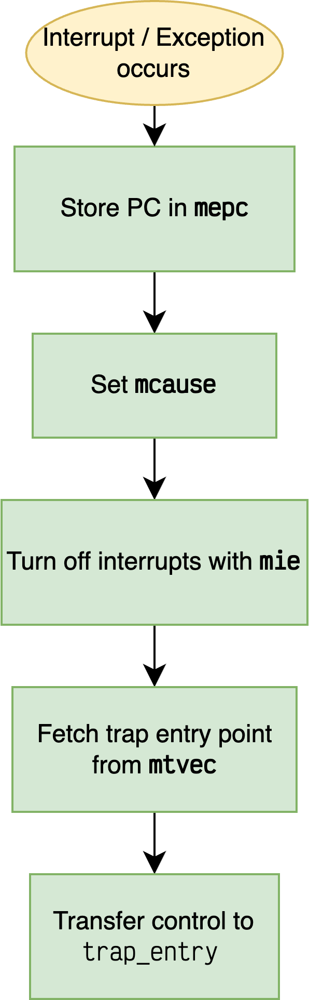

# Interrupts on RISC-V

## Terminologies

- **Exception** : Used to refer to an unusual condition occurring at runtime (ie _synchronous_ in nature) associated with an instruction in the current core. Eg : illegal instruction, division-by-zero etc.

- **Interrupt** : Refers to an external _asynchronous_ event that may cause a hart to experience unexpected transfer of control. Typically triggered by peripherals.

- **Trap** : The transfer of control to a trap handler caused by either an exception or an interrupt.

---

A subset of CSRs(**C**ontrol and **S**tatus **R**egisters) assist in handling traps. The registers are discussed briefly here, for detailed information, consult RISC-V ISA manual vol2 (Privileged).

- `mtvec` (Machine Trap-Vector base-adress register) - Holds the trap vector configuration. Prominently the base address of the trap vector.
- `mie` (Machine Interrupt Enable) - Used to enable machine-mode interrupts. These are classified as :
    - External interrupts
    - Timer interrupts
    - Software interrupts (exceptions)
- `mstatus` (Machine Status) - Keeps track of and control the CPU's current operating status. Setting `MIE` bit in `mstatus` registers enables machine-mode interrupts globally.
- `mepc` (Machine Exception Program Counter) - Holds the PC (program counter) value when an interrupt/exception is encountered. 
- `mcause` (Machine Cause Register) - The highest bit (XLEN-1) indicates whether the trap was cause by exception(0) or interrupt(1). The rest of the bits contain exception code.

## Setting trap entry

This is implemented in software.

---

## When an interrupt occurs

Performed by hardware.

---

## Handling interrupts

Implemented in software.

## More resources 

- [Blog by Muller Lee](https://mullerlee.cyou/2020/07/09/riscv-exception-interrupt/)
- [RISC-V ISA Manual Vol-2 (Privileged)](https://github.com/riscv/riscv-isa-manual)
- [Youtube : John's Basement Introduction to RV32I Interrupts and Traps](https://youtu.be/l7JIry6PEX4)
- [Youtube : Robert Baruch - Interrupts and Exceptions](https://youtu.be/oAIBLeesRlg)

