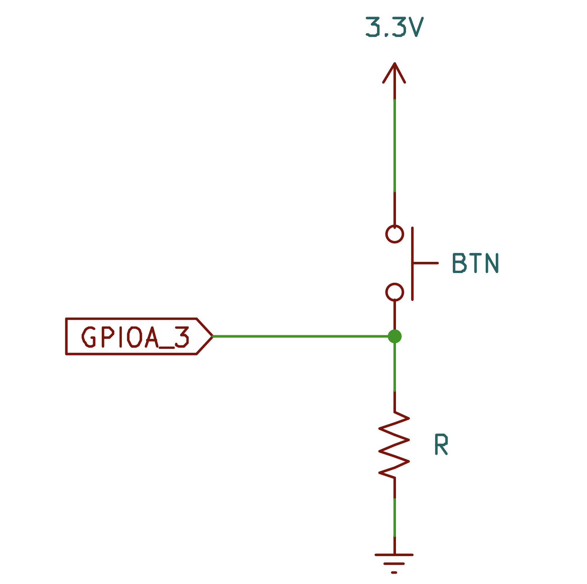

The GPIO interrupts are active-high trigerred. Schematic here shows a push-button connected to GPIOA Pin 3 (same as in example program), pulled down to ground using a resistor, and the other end connected to $3.3V$

